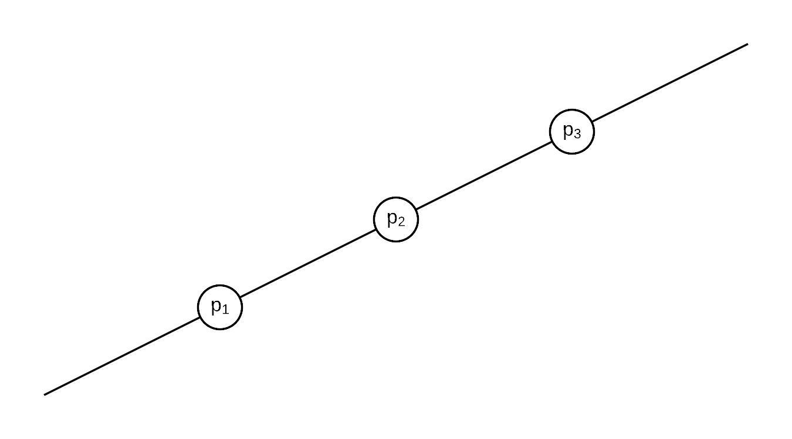
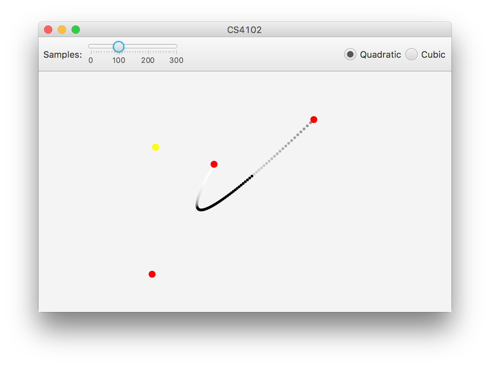
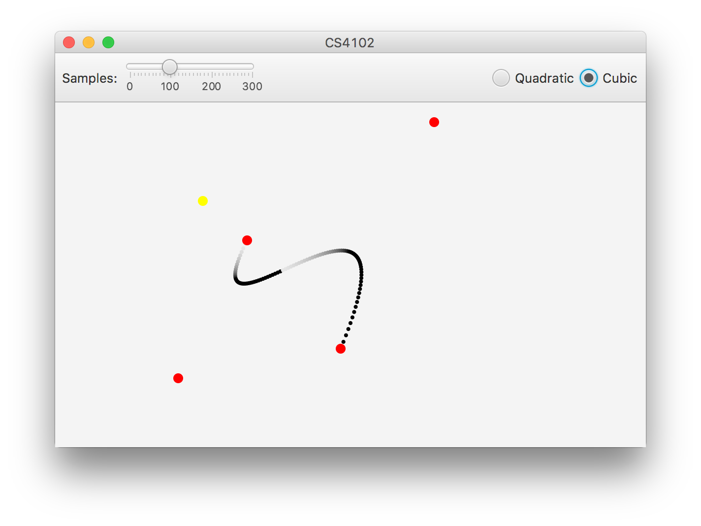

# Introduction

In this practical, my task is to implement a simple Java application with a GUI that lets the user define and sample Bézier curves. Each point on the curve is illuminated by a single point light, accounting for self-occlusion.

My application supports both quadratic and cubic bezier curves. The user can select which type they wish to use.

# Design and Implementation

## Vectors

Vectors are represented with instances of the `Vector` class. This class contains methods for arithmetic (add, subtract, multiply, divide), calculating the length of a vector, converting to a unit vector and calculating a dot product.

## Bézier Curves

To work with Bézier curves I created an abstract `BezierCurve` class containing a number of useful methods:

* `Vector sample(double u)` samples the curve at the specified point
* `Vector tangent(double u)` returns the tangent vector at the specified point
* `Vector normal(double u)` returns the curve normal vector at the specified point
* `Vector[] coefficients()` calculates the coefficients of a polynomial defining the curve
* `List<Vector> intersection(Vector l1, Vector l2)` finds the points where the specified line intersects the curve

The abstract class is then implemented by the `QuadraticBezierCurve` and `CubicBezierCurve` classes which each define their own calculations.

### Sampling

The standard formulas provided in the lectures are used for sampling the curves.

For quadratic curves:

$$p(u) = (1-u)^2 p_1 + 2u (1-u) p_2 + u^2 p_3$$

For cubic curves:

$$p(u) = (1-u)^3 p_1 + 3u (1-u)^2 p_2 + 3u^2 (1-u) p_3 + u^3 p_4$$

### Tangent Vectors

The formulas for tangents can be obtained by differentiating the sample formulas. I have derived these by hand.

For quadratic curves:

$$t(u) = (2u - 2) p_1 + (2 - 4u) p_2 + 2u p_3$$

For cubic curves:

$$t(u) = -3 (1-u)^2 p_1 + 3 (3u^2 - 4u + 1) p_2 + 3 (-3u^2 + 2u) p_3 + 3u^2 p_4$$

### Normal Vectors

To obtain a normal vector I simply calculate the tangent vector and rotate it to the left by 90 degrees.

### Intersection Points

In order to be able to determine which points on the curve are illuminated, I needed to calculate the points where a line intersects the curve. To do this, I converted the curve equation into a polynomial.

For quadratic curves:

$$p(u) = (p_1 - 2 p_2 + p_3) u^2 + (-2 p_1 + 2 p_2) u + p_1$$

For cubic curves:

$$p(u) = (-p_1 + 3 p_2 - 3 p_3 + p4) u^3 + (3 p_1 - 6 p_2 + 3 p_3) u^2 + (-3 p_1 + 3 p_2) u + p_1$$

Next, I expressed the line using the general form $ax + by + c = 0$ where $a = y_1 - y_2$, $b = x_2 - x_1$, $c = x_1 y_2 - x_2 y_1$ and $x_1$, $y_1$, $x_2$, $y_2$ are coordinates of two points on the line.

Once I had the line equation, I substituted the $x$ and $y$ in the line equation with the curve polynomial:

$$a x(u) + b y(u) + c = 0$$

where $x(u)$ and $y(u)$ are x and y coordinates of a point on the line at $u$.

By expanding the equation I obtained a quadratic or cubic equation. To find the intersection points, I calculated the roots of these equations and sampled the curve for each root in the range $[0, 1]$ (ignoring any intersection point that is not on the curve).

## Illumination

For illumination, I used the calculation from the practical specification: the dot product of the curve unit normal vector and the unit vector in the direction from the sampled point to the light. The result of the dot product is a value between -1 and 1. I simply take the absolute value (so that the curve can be illuminated from both sides) and create a greyscale value from 0 to 255.

To account for self-occlusion, first I calculate the intersection between the line from the point to the light source and the curve, using the method described before. This results in a list of points on the curve that crosses the line. I add the point of the light source to the list and sort the points by their $(x, y)$ values. Since all these points are on a single line, this results in the ordering in which the points are on the line.

For example, if we have points $p_1$, $p_2$ and $p_3$ shown in Figure \ref{fig:sorted_vectors}, the sorted list would contain the points in the order $(p_1, p_2, p_3)$.

{#fig:sorted_vectors}

Next, I find the index of the current sampled point in the list of points and the index of the light source point. Finally, to find out if the point is illuminator or occluded, I check the difference between the indexes. If it is 1, it means that there is no other point between them and the sampled point is illuminated.

Using this method would let me have any number of curves and still calculate the occlusion. Instead of intersection points of just one curve, the points of all curves would be used in the algorithm.

## User Interface

I used JavaFX for implementing the GUI of the application. The state of the application, including the number of samples and positions of the control points and the light source, is stored in the `Scene` class using observable JavaFX properties.

The UI controls are implemented using native JavaFX components and my custom `DragPoint` component. Its role is to render a circle on the screen and respond to mouse drag events. When the point is dragged by clicking and holding the mouse button, it updates its position property. Drag points are used for curve control points and the light source.

The number of samples is selected using a slider component, and two radio buttons are used to select either cubic or quadratic Bézier curves.

The state properties are bound using JavaFX bindings with UI controls in the `Controller` class, which listens for changes in the state and re-renders the curve when any of the properties change.

The curve is rendered using the `Renderer` class and a canvas JavaFX component. The renderer simply uses the `BezierCurve` class and the number of properties to obtain point samples. The samples are rendered one by one by drawing circles on the canvas using the appropriate colour based on the illumination value.

# Testing

I tested the application with a combination of manual testing and unit tests.

During the development, I simply ran the application and dragged the points to check if the produced curve is rendered correctly, including the illumination and occlusion calculations.

Unit tests are used for testing the utility methods for calculating line coefficients and solving quadratic equations.

# Conclusion

I implemented an application that meets all basic requirements. The user is able to set the position of the curve control points and the light. The application samples the specified curve, renders the samples and calculates the illumination, accounting for self-occlusion.

As an extension, I implemented an option to use cubic Bézier curves instead of quadratic curves. I also designed the application so that it would be possible to extend it with drawing multiple curves. The illumination and occlusion calculation is able to handle any number of curves. Unfortunately, I did not have time to implement the GUI for multiple curves.

I found this practical challenging as I needed to derive formulas to calculate the tangents and intersection points. However, it helped me better understand how Bézier curves and illumination models work.